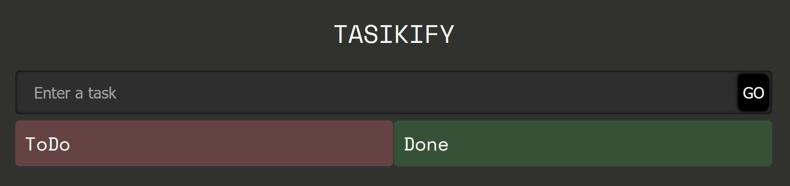
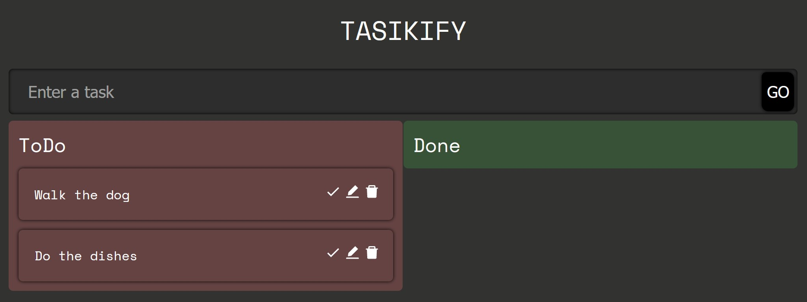
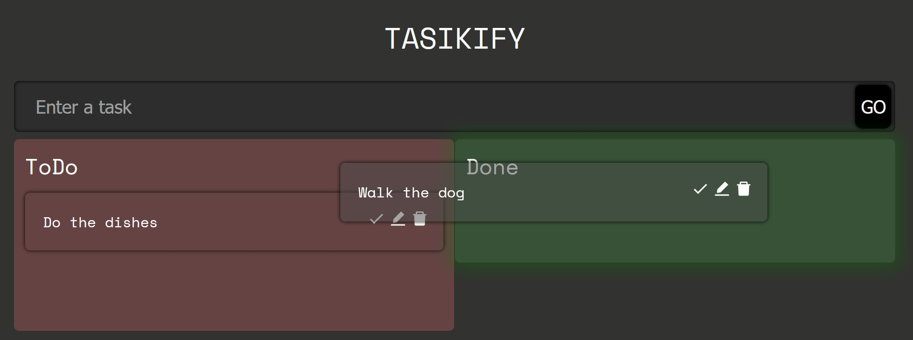
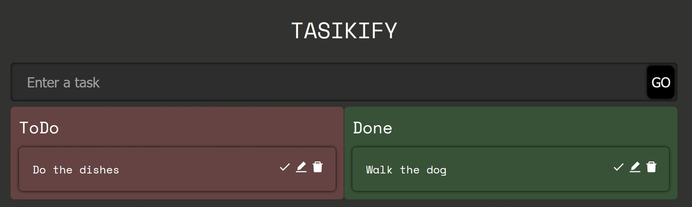
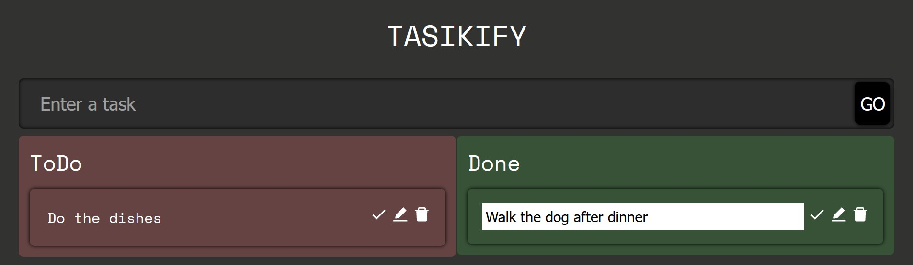
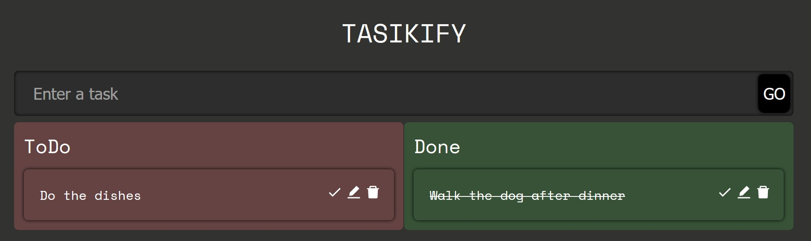
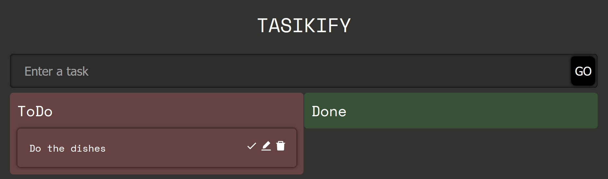

# React & Typescript with Drag & Drop

Simple React app to demonstrate drag & drop functionality with Typescript.

## Images of the app

#### Empty todo list

#### Items in the todo list

#### State during drag

#### State after drop

#### Making an edit

#### Striking out an item

#### Deleting an item
